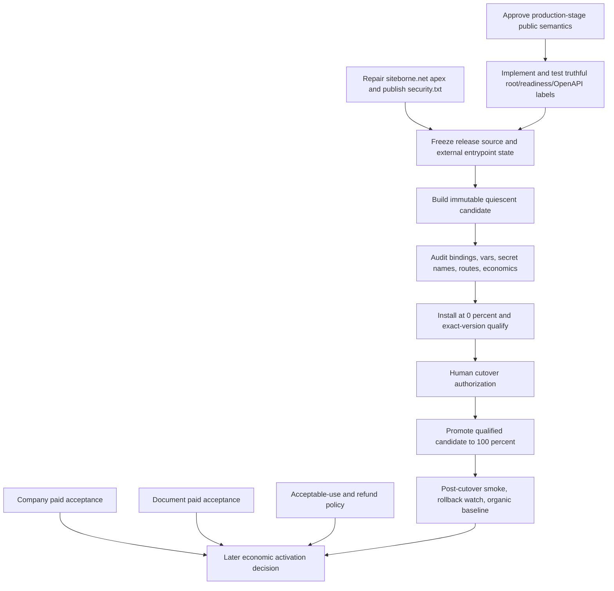

# SITEBORNE Pre-Cutover Release-Gate Inventory and Critical Path

**Checkpoint:** `METADATA-VCM-09`

**Mode:** read-only release audit and critical-path design

**Date:** 2026-09-17

**Result:** `PASS` (audit complete; production cutover is not yet ready)

## 1. Executive decision

SITEBORNE's metadata and VCM work is not the remaining release blocker. The
qualified immutable primary-compare candidate is sound for its exact scope, but
the public product still describes itself as preproduction and not ready, while
the network-identity apex returns HTTP 525 and no `security.txt` is published.
Those facts make a real production launch internally contradictory even though
the Worker, Agent Card, MCP, A2A, stateful infrastructure, credentials, and
rollback mechanics are already substantially qualified.

The authoritative release model is staged:

1. **Initial public-runtime cutover:** publish truthful production-stage status,
   complete the public network-identity entrypoint, build and qualify a new
   immutable quiescent candidate, and promote it under human authority. Paid
   routes remain off.
2. **Post-cutover observation:** establish the first representative organic
   baseline after real launch; current sparse traffic is not such a baseline.
3. **Economic activation:** separately authorize an immutable paid candidate
   only for service capabilities whose current source, provider, settlement, and
   live acceptance evidence are complete.

This staging is already the repository's operating model. Uploading or promoting
the current VCM candidate would change metadata-producer provenance, but it
would not cure the public release-state contradiction, repair the apex, or
enable economic execution. `vcm_only`, registry rewriting, and authority
inversion are not prerequisites for initial production.

```text
PRODUCTION_CUTOVER_READY_NOW=NO
CUTOVER_BLOCKER_COUNT=4
IMPLEMENTATION_BLOCKER_COUNT=1
CONFIGURATION_BLOCKER_COUNT=1
CREDENTIAL_BLOCKER_COUNT=0
EVIDENCE_BLOCKER_COUNT=1
HUMAN_AUTHORIZATION_BLOCKER_COUNT=1
```

The evidence blocker is downstream: any source/config repair requires one new
immutable candidate and exact-version qualification. It is not a defect in
candidate `287bcd9f-98d1-4741-a832-76dfa88b202c`.

## 2. Authoritative starting state

| Fact                     | Value                                            | Evidence                              |
| ------------------------ | ------------------------------------------------ | ------------------------------------- |
| Repository               | `/Users/meta4ickal/SITEBORNE Utility Network`    | local checkout                        |
| Branch                   | `metadata-vcm-qualification`                     | Git readback                          |
| Starting local HEAD      | `0726fd035764b52da8bee53ac55c1e757ff91df3`       | Git readback                          |
| Starting remote HEAD     | `0726fd035764b52da8bee53ac55c1e757ff91df3`       | upstream readback                     |
| Starting provenance      | PASS                                             | local and remote exact                |
| Stable Worker version    | `38cbf4dd-52fd-4afc-ad34-626a2e6454d3` at 100%   | read-only deployment status           |
| VCM candidate            | `287bcd9f-98d1-4741-a832-76dfa88b202c` at 0%     | read-only deployment status           |
| Active deployment        | `7e19fd3e-ccea-4680-9e63-06bcbd0625bd`           | read-only deployment status           |
| Candidate Worker version | 96                                               | immutable version readback            |
| Candidate source         | `657d30c0c43f262ce110b07b90c58edf05b510b3`       | tag/message/readback                  |
| Candidate tag            | `metadata-vcm-impl-06-primary-compare-candidate` | immutable version readback            |
| A2A/MCP candidate modes  | `vcm_primary_compare` / `vcm_primary_compare`    | immutable vars                        |
| Candidate paid admission | `PAID_ROUTES_ENABLED=false`                      | immutable vars                        |
| Real production cutover  | NO                                               | METADATA-VCM-07C-R1                   |
| Authority inversion      | NO                                               | implementation and live qualification |

Fresh read-only deployment inspection during this audit still showed the exact
100/0 split. No version, deployment, traffic, trigger, route, variable, secret,
binding, or source mutation occurred.

## 3. Evidence method and temporal rules

The audit used current source, current Git history, current immutable-version
and deployment readbacks, fresh public HTTP/DNS probes, fresh
`production:preflight`, and the repository's accepted reports. An older PASS was
reused only when its governed source/configuration remained unchanged or a newer
checkpoint explicitly preserved it.

The following files are **historical context, not current operational
authority**:

- `PROJECT_STATE.yaml`;
- `TASKS.yaml`.

`METADATA-AUTHORITY-01` already classified both as `HISTORICAL_ONLY`. They are
dated to August, contain many now-resolved blockers, and are not consumed by a
live runtime path. Their missing historical-only banner remains documentation
hygiene, not a cutover gate. Current facts come from runtime source, immutable
version metadata, live bindings, accepted checkpoint reports, contract releases,
governance, and public probes.

## 4. Canonical release ledger

| Checkpoint or artifact                          | Order / commit                        | Scope and result                                    | What it proved                                                                               | What it did not prove                                           | Current validity / supersession                                         | Cutover relevance                                                    |
| ----------------------------------------------- | ------------------------------------- | --------------------------------------------------- | -------------------------------------------------------------------------------------------- | --------------------------------------------------------------- | ----------------------------------------------------------------------- | -------------------------------------------------------------------- |
| Foundation and domain tasks                     | SUN-0001 through SUN-0012             | Partial historical ledger                           | Intended domains, DNSSEC, policies, wallet separation                                        | Completion of external domain tasks                             | PARTIAL; operational state must be probed                               | Apex, DNSSEC, and public policies remain relevant                    |
| Contract/PCC releases                           | contract releases 1.0.0, 1.0.1, 2.0.0 | PASS                                                | Versioned contracts, schemas, compatibility law                                              | Live service execution                                          | VALID                                                                   | Closed source/contract gate                                          |
| Local services/provider adapters                | SUN-0300 through SUN-0600             | PASS in defined scopes                              | Deterministic adapters, terms gates, PCC/service logic                                       | Production credentials and live provider acceptance             | VALID, later production compositions supersede fixture-only conclusions | Basis for current source reality                                     |
| x402 core and live rail                         | SUN-0700A/B lineage                   | PASS in exact/testnet and later mainnet scopes      | Payment boundary, replay/idempotency, CDP facilitator paths                                  | Full current four-service live success                          | PARTIAL                                                                 | Closed protocol core; live service evidence remains service-specific |
| Public MCP/A2A release                          | SUN-0800A/B                           | PASS                                                | Public `/mcp`, `/a2a`, signed Agent Card/JWKS, npm release                                   | Later VCM producer selection                                    | VALID; extended by VCM                                                  | Closed protocol gate                                                 |
| Nevermined                                      | SUN-0900B and v2 registration lineage | PASS for sandbox/registration                       | Sandbox plans, credits, recovery, visible registrations                                      | Nevermined production rail                                      | VALID; production rail intentionally unavailable                        | Optional for initial CDP/public cutover                              |
| Security release gate                           | SUN-1000 closure lineage              | PASS                                                | No critical/high release blocker under accepted scans; load, chaos, schema, governance gates | Future vulnerabilities after source change                      | VALID for qualified source                                              | Closed until relevant source/dependency change                       |
| Registry/publication                            | SUN-1100 checkpoint 3                 | PASS                                                | MCP Registry active, Agentverse active, Nevermined plans visible                             | Organic use                                                     | VALID                                                                   | Closed discovery publication gate                                    |
| Production preflight/candidate freeze           | SUN-1203/1205                         | Historical PASS                                     | Fail-closed config and candidate discipline                                                  | Later real executor/source state                                | SUPERSEDED by SUN-122x                                                  | Method remains valid; facts superseded                               |
| First paid runtime / stabilization              | SUN-1220Q through SUN-1222A           | PASS in recorded scopes                             | Real payment, provider, settlement and recovery for initial services                         | All four current services                                       | PARTIAL                                                                 | Supports verify/web; not full four-service acceptance                |
| Four-service source and infrastructure          | SUN-1222B/C lineage                   | PASS for source/infrastructure; mixed live outcomes | Real typed production compositions, D1/R2/Workflow/Modal bindings, artifact controls         | Successful current-lineage paid completion for company/document | PARTIAL                                                                 | Full economic activation remains gated                               |
| Atomic public/PCC cutover and Model-C migration | SUN-1222C PCC/Model-C lineage         | PASS                                                | Version compatibility, quiescence, migration/backfill, rollback ordering                     | Present-day organic launch                                      | VALID for state/rollback architecture                                   | Closed stateful migration gate                                       |
| Storage alert release                           | SUN-1222C R4/D-series/final baseline  | PASS                                                | Scheduled reclamation, service-binding receiver, real SMTP delivery, fail-closed cleanup     | Durable query of every natural historical Cron invocation       | VALID; accepted telemetry limitation                                    | Closed with accepted limitation                                      |
| VCM design and truth core                       | METADATA-VCM-01 through 05            | PASS                                                | Canonical facts, release/current temporal split, 8/8 registry parity/economics               | Serving cutover                                                 | VALID                                                                   | Closed metadata model gate                                           |
| VCM shadow and multiversion safety              | IMPL-03A through 04B-R3 and VCM-07    | PASS                                                | A2A/MCP parity, JSON/SSE observation, multiversion Cron safety                               | VCM as selected producer under traffic                          | VALID                                                                   | Closed shadow gate                                                   |
| Pre-cutover 90/10 experiment                    | VCM-07B/07C-R1                        | PASS after reclassification                         | Gradual-deployment mechanics, ordinary candidate and scheduled execution, return to zero     | Representative post-cutover organic behavior                    | VALID as pre-cutover mechanics only                                     | Post-cutover traffic gate deferred                                   |
| Primary-compare design/implementation           | VCM-08, IMPL-05                       | PASS                                                | Reversible producer selection; legacy fallback/reference; handler/signer preservation        | Live exact-version path                                         | VALID                                                                   | Closed locally                                                       |
| Immutable primary-compare candidate             | IMPL-06, commit `0726fd0`             | PASS                                                | 0% exact-version A2A/MCP VCM selection, signed A2A, six MCP tools, no fallback/errors        | Nonzero traffic, actual production launch, paid execution       | VALID                                                                   | Metadata candidate is qualified                                      |

### Evidence defects that do not invalidate the ledger

`docs/reports/SUN-1222C-final-production-closure.md` is a five-line file that
contains an elision placeholder rather than the advertised complete evidence. It
is not used as sole authority. The underlying runtime commits, dedicated
reports, immutable version readbacks, and subsequent VCM reports provide the
necessary facts. This is an evidence-quality defect and should be repaired when
the original text is available; it does not by itself invalidate the deployed
baseline.

## 5. Historical blocker reconciliation

This audit reconciled 22 historical blocker families: 18 are resolved for the
initial public cutover, two remain blocking, and two remain open only for later
economic or business completion.

| Original blocker                    | Original evidence                             | Current state                                                                                                                                          | Resolution                        | Current cutover impact                                                   |
| ----------------------------------- | --------------------------------------------- | ------------------------------------------------------------------------------------------------------------------------------------------------------ | --------------------------------- | ------------------------------------------------------------------------ |
| Fixture-backed production executors | early `paid-services.ts` and SUN-120x reports | v1 fixture builder remains dev/local and is not a production mount; v2 production routes use typed real compositions and durable Workflow dependencies | YES for current v2 source         | Not a quiescent cutover blocker                                          |
| Missing provider credentials        | older Cloudflare/Modal gates                  | Candidate exposes the exact 14 required secret binding names; values were not inspected                                                                | YES by presence/config evidence   | No credential blocker while paid routes remain off                       |
| Nevermined credential/config        | early `NVM_API_KEY` absence                   | `NVM_API_KEY` binding exists; environment is deliberately `sandbox`; live is hard-disabled                                                             | PARTIAL by design                 | Optional rail; not initial cutover blocker                               |
| CDP production credentials          | earlier provenance gap                        | Names present; fresh human mainnet authorization and containment evidence exist                                                                        | YES                               | Not initial cutover blocker; required for later economics                |
| Paid execution enablement           | initially absent                              | Current stable/candidate intentionally set `PAID_ROUTES_ENABLED=false`                                                                                 | NOT APPLICABLE to initial cutover | Later cutover action, not current public-runtime gate                    |
| Public economic metadata            | old registry/price drift                      | VCM economic validity 8/8 and governed price projection pass                                                                                           | YES                               | Closed                                                                   |
| Strong authentication declaration   | early trust-score gap                         | Current public metadata truthfully omits mTLS; existing surfaces retain their actual auth/payment rules                                                | YES for truthful declaration      | Optional enhancement                                                     |
| Verified/legal identity             | marketplace score analysis                    | Core Agent Card must not fabricate legal entity identity                                                                                               | OPTIONAL                          | Does not block SITEBORNE production                                      |
| Security declaration                | earlier incomplete Agent Card                 | Signed card/JWKS and runtime overlay are qualified; mTLS omitted when inactive                                                                         | YES                               | Closed                                                                   |
| mTLS                                | designed but inactive                         | Source capability exists; no production mTLS surface is active or advertised                                                                           | OPTIONAL                          | Does not block current routes                                            |
| x402 production readiness           | early local/testnet only                      | Core/mainnet rail and durable settlement path exist; service acceptance remains per-service                                                            | PARTIAL                           | Does not block quiescent cutover; blocks unsupported economic activation |
| Service executor reality            | fixture era                                   | Four v2 real compositions exist; no fixture fallback in production path                                                                                | YES in source                     | Live success evidence remains service-specific                           |
| Provider invocation                 | no live calls                                 | Verify/web have successful historical production proof; company/document lack complete current-lineage paid success                                    | PARTIAL                           | Post-cutover economic blocker only                                       |
| Settlement/facilitator              | missing initial configuration                 | Dedicated Workflow is sole settlement owner; payment recovery and Model-C migration qualified                                                          | YES                               | Closed architecture gate                                                 |
| Release/contract/provenance drift   | multiple historical reports                   | Current qualified source, contract checks, digests, and immutable message/tag provenance pass                                                          | YES                               | Closed for candidate 287                                                 |
| Scheduled-path evidence             | Cron routing semantics undocumented           | Adversarial multiversion proof plus real stable scheduled event and live receiver evidence                                                             | YES with limitation               | Accepted limitation; no cutover block                                    |
| Durable audit limitation            | natural Cron history not fully queryable      | Live tail and bounded alerts exist; durable historical query remains limited                                                                           | PARTIAL                           | Accepted limitation                                                      |
| Metadata parity/inversion           | registry/current drift                        | Shadow and primary-compare live match; legacy reference retained; `vcm_only` unservable                                                                | YES                               | Closed                                                                   |
| Registry authority                  | frozen release/current-state confusion        | TARGET_D temporal split accepted; old releases frozen                                                                                                  | YES                               | Closed                                                                   |
| Registry/Agentverse publication     | older `NO_MATCH`                              | MCP Registry and Agentverse are active; Nevermined plans visible                                                                                       | YES                               | Closed                                                                   |
| Domain/network identity             | SUN-0006 through SUN-0010                     | Cloudflare NS and utility origin work, but `siteborne.net/` and its security path return 525; DS is absent                                             | NO                                | **Blocks initial production release truthfulness**                       |
| Startup applications                | master-directive completion condition         | No generated application bundle found                                                                                                                  | NO                                | Optional business work; does not block runtime cutover                   |

## 6. Source and provider reality

### 6.1 Externally valuable service identities

| Service                     | Implementation reality                                                                | Current provider               | Production capable | Current runtime gate                        | Required credential proof | Cutover blocker                                          |
| --------------------------- | ------------------------------------------------------------------------------------- | ------------------------------ | ------------------ | ------------------------------------------- | ------------------------- | -------------------------------------------------------- |
| `company_evidence_graph.v1` | Frozen compatibility identity; local fixture builder only; no active production route | Fixtures only                  | NO                 | No production mount                         | N/A                       | No; compatibility metadata only                          |
| `web_context_verified.v1`   | Frozen compatibility identity; local fixture builder only; no active production route | Fixtures only                  | NO                 | No production mount                         | N/A                       | No; compatibility metadata only                          |
| `document_evidence_json.v1` | Frozen compatibility identity; local fixture builder only; no active production route | Fixtures only                  | NO                 | No production mount                         | N/A                       | No; compatibility metadata only                          |
| `verify_agent_output.v1`    | Frozen compatibility identity; local fixture builder only; no active production route | Fixtures only                  | NO                 | No production mount                         | N/A                       | No; compatibility metadata only                          |
| `company_evidence_graph.v2` | Real typed production composition through durable continuation                        | Modal plus SEC/public adapters | Source-capable     | global paid gate + service flag             | Names present             | Live paid acceptance remains open; not quiescent blocker |
| `web_context_verified.v2`   | Real typed production composition through durable continuation                        | Modal safe-egress              | YES                | global paid gate + service flag             | Names present             | None for scoped later activation                         |
| `document_evidence_json.v2` | Real R2/Modal document composition and durable path                                   | R2 plus Modal document worker  | Source-capable     | global paid gate + service and upload flags | Names present             | Live paid acceptance remains open; not quiescent blocker |
| `verify_agent_output.v2`    | Real in-process verification composition and durable continuation                     | Verification mesh              | YES                | global paid gate + service flag             | Names present             | None for scoped later activation                         |

The repository still contains test fixtures and a fixture-only local builder.
That is not production fallback: current production-facing v2 route modules
import dedicated production compositions, and the fail-closed preflight proves
the older 12-route fixture surface is structurally unavailable.

### 6.2 Current economic posture

```text
PAID_ROUTES_ENABLED_CURRENTLY=false
PRODUCTION_ENABLED=true
PAYMENT_ENVIRONMENT=production
PRODUCTION_CDP_CREDENTIALS_APPROVED=true
HUMAN_AUTHORIZED_PRODUCTION_BOOTSTRAP=true
```

The last four values establish configured capability. They do not override the
global admission switch. Current ordinary requests cannot enter paid execution.

| Route/capability             | Provider             | Price authority                                       | Payment/settlement authority                             | Current gate                                      | Real executor     | Safe now           | Release disposition                                  |
| ---------------------------- | -------------------- | ----------------------------------------------------- | -------------------------------------------------------- | ------------------------------------------------- | ----------------- | ------------------ | ---------------------------------------------------- |
| `/v2/verify/agent-output`    | verification mesh    | `governance/RISK_LIMITS.yaml` through pricing package | CDP/x402 verify; dedicated Workflow settles              | disabled globally; service flag true              | YES               | YES while disabled | Later scoped activation eligible                     |
| `/v2/web/context`            | Modal safe-egress    | same governed path                                    | same                                                     | disabled globally; service flag true              | YES               | YES while disabled | Later scoped activation eligible                     |
| `/v2/company/evidence-graph` | Modal + SEC adapters | same governed path                                    | same                                                     | disabled globally; service flag false             | YES               | YES while disabled | Needs current-lineage paid success before activation |
| `/v2/document/evidence-json` | R2 + Modal           | governed tier/ceiling                                 | `upto` verification and durable actual-amount settlement | disabled globally; service and upload flags false | YES               | YES while disabled | Needs current-lineage paid success before activation |
| `/v2/artifacts/documents`    | R2/D1 ingress        | not a paid route itself                               | none                                                     | disabled by global + upload flags                 | real storage path | YES while disabled | Activate only with document service and controls     |

The release sequence is therefore **C: staged**. Initial production can be a
quiescent public/discovery runtime. Full economic capability is a later,
separately authorized mutation. No paid call is needed to prove the initial
metadata/runtime cutover.

## 7. Security, authentication, and identity

| Mechanism                        |                                     Implemented |              Configured |                           Active |                                     Verified | Public declaration truthful | Cutover blocker              |
| -------------------------------- | ----------------------------------------------: | ----------------------: | -------------------------------: | -------------------------------------------: | --------------------------: | ---------------------------- |
| Agent Card ES256 signing         |                                             YES |                     YES |                              YES |                      YES against public JWKS |                         YES | No                           |
| JWKS                             |                                             YES |                     YES |                              YES | YES; one public P-256 key, no private member |                         YES | No                           |
| MCP request/protocol validation  |                                             YES |                     YES |                              YES |  YES including malformed/size/unknown method |                         YES | No                           |
| A2A protocol validation          |                                             YES |                     YES |                              YES |                                          YES |                         YES | No                           |
| x402 payment authorization       |                                             YES |                     YES | inactive because paid gate false |     Historically verified in scoped releases |                         YES | No for initial cutover       |
| API/provider secret bindings     |                                             YES |             YES by name |       consumed only behind gates |         Presence and prior scoped use proven |     Not publicly enumerated | No credential blocker        |
| mTLS caller-context capability   |                                   YES in source | NO production interface |                               NO |                     Not production-qualified |           Correctly omitted | Optional                     |
| OAuth/OIDC public client auth    | No general public requirement in current routes |                     N/A |                               NO |                                          N/A |                 Not claimed | Optional                     |
| Legal-entity / Verified Identity |                      Not a core Agent Card fact |                     N/A |                               NO |                                           NO |                 Not claimed | Optional marketplace scoring |

The governing security law remains
`IMPLEMENTED -> CONFIGURED -> ACTIVE -> VERIFIED`. Current declarations do not
overstate mTLS or legal identity. Stronger marketplace trust scores are optional
unless a future release decision makes them normative.

Fresh public probes found no `/.well-known/security.txt` on either
`siteborne.net` or `utility.siteborne.net`; the apex request fails before
content. This belongs to the network-identity completion gate, not the Agent
Card/JWKS cryptographic gate.

## 8. Protocol and discovery surfaces

| Surface                  | Public route                                  | Current status                                              | Canonical version/authority                                             | Drift/qualification                                    | Cutover blocker                  |
| ------------------------ | --------------------------------------------- | ----------------------------------------------------------- | ----------------------------------------------------------------------- | ------------------------------------------------------ | -------------------------------- |
| Health                   | `GET /health`                                 | 200 JSON                                                    | edge source                                                             | Qualified                                              | No                               |
| Readiness                | `GET /ready`                                  | 200 JSON but literal `status=not_ready`, `phase=foundation` | hardcoded `readiness.ts` plus runtime service flag                      | Schema-valid but release-state stale                   | **Yes**                          |
| Utility root             | `GET /`                                       | 200 JSON with `preproduction foundation`                    | hardcoded `index.ts`                                                    | Publicly contradicts production launch                 | **Yes**                          |
| Agent Card               | `/.well-known/agent-card.json`                | 200 signed A2A JSON                                         | VCM primary candidate + independent legacy comparator + existing signer | Live primary match                                     | No                               |
| JWKS                     | `/.well-known/jwks.json`                      | 200                                                         | existing signer identity                                                | Live signature verification                            | No                               |
| A2A                      | `POST /a2a`                                   | Public                                                      | A2A transport/contracts                                                 | Qualified; no economic activation                      | No                               |
| MCP                      | `POST /mcp`                                   | Public                                                      | protocol `2026-07-28`; six tools                                        | JSON/SSE/local/live primary qualification pass         | No                               |
| OpenAPI                  | `/openapi.json`                               | 200                                                         | generated PCC/OpenAPI source                                            | Drift checks pass; prose retains preproduction history | Part of truthfulness remediation |
| x402/Bazaar              | discovery metadata on current surfaces        | available with runtime-disabled economics                   | governed pricing, scheme/network support, route state                   | Qualified for disabled state                           | No for initial cutover           |
| MCP registry auth        | `siteborne.net/.well-known/mcp-registry-auth` | 200                                                         | narrow Worker route                                                     | Qualified                                              | No                               |
| Catalog/service registry | `/catalog`, `/services/:id`                   | 200; services production-disabled                           | runtime resolver plus frozen release registry                           | Correct for paid-disabled posture                      | No                               |
| Schemas                  | `/schemas`                                    | 200                                                         | versioned schema packages                                               | Qualified                                              | No                               |
| Benchmarks               | `/benchmarks`                                 | 200                                                         | repository benchmark artifacts                                          | Release-relevant but non-authoritative                 | No                               |
| Network apex             | `https://siteborne.net/`                      | HTTP 525                                                    | proxied DNS record with no valid origin                                 | Known, documented, unresolved                          | **Yes**                          |

Canonical metadata is internally consistent for the paid-disabled runtime. The
remaining contradiction is the platform-level release label: a production launch
cannot simultaneously advertise `not_ready`, `foundation`, and
`preproduction foundation` as current operational truth.

## 9. VCM release state

```text
VCM_REQUIRED_STATE_FOR_INITIAL_PRODUCTION=VCM_PRIMARY_COMPARE_OR_QUALIFIED_LEGACY_SERVING;_VCM_ONLY_NOT_REQUIRED
CURRENT_VCM_STATE=IMMUTABLE_VCM_PRIMARY_COMPARE_CANDIDATE_QUALIFIED_AT_0_PERCENT
VCM_GAP_BEFORE_CUTOVER=NONE_IN_VCM_SEMANTICS
AUTHORITY_INVERSION_REQUIRED_BEFORE_CUTOVER=NO
VCM_ONLY_REQUIRED_BEFORE_CUTOVER=NO
```

Candidate 287 proved live A2A and MCP VCM selection after independent legacy
construction, validation, and semantic match. A2A signing followed selection;
MCP executable handlers stayed outside VCM; fallback remained available;
`vcm_only` stayed unservable. The candidate may be reused as evidence, but a
release-state source correction necessarily creates a new candidate.

## 10. Stateful systems

| System                 | Production binding/state                            | Qualified                 | Idempotency / multiversion                                    | Known limitation                                       | Cutover blocker        |
| ---------------------- | --------------------------------------------------- | ------------------------- | ------------------------------------------------------------- | ------------------------------------------------------ | ---------------------- |
| D1                     | `siteborne-utility` bound                           | YES                       | CAS/state-machine/recovery proven                             | No new migration required for current candidate        | No                     |
| R2                     | `siteborne-artifacts` bound                         | YES                       | idempotent reclamation ordering                               | Provider ingress remains disabled                      | No                     |
| KV                     | `CATALOG` bound                                     | YES for current use       | No state ownership critical to cutover                        | Some historical reports called it unused               | No                     |
| JOBS/EVENTS queues     | bound                                               | Binding parity qualified  | Current cutover path does not rely on a new consumer          | Historical config surface                              | No                     |
| Paid Workflow          | separate host `siteborne-paid-continuation-runtime` | YES                       | deterministic IDs, create-race recovery, Model-C owner intent | Economics disabled at public edge                      | No                     |
| Scheduled handler      | every minute                                        | YES                       | adversarial multiversion models pass                          | Cloudflare split selection is undocumented             | No                     |
| Storage alert receiver | private service binding                             | YES                       | fail-closed delivery; real mailbox proof                      | Natural Cron history not durably queryable             | Accepted limitation    |
| Payment recovery       | scheduled scan + deterministic Workflow ownership   | YES                       | retries/concurrency analyzed                                  | Duplicate content-free alert possible during outage    | Accepted limitation    |
| Artifact handling      | D1/R2 with scheduled reclamation                    | YES while upload disabled | idempotent delete ordering                                    | Economic document activation needs separate acceptance | No for initial cutover |
| Provider invocations   | gated off on public candidate                       | Source paths real         | Workflow owns durable execution                               | Company/document live success incomplete               | Later economics only   |

### Cron disposition

```text
CRON_EXPRESSION=* * * * *
CRON_RELEASE_READY=YES
CRON_BLOCKERS=NONE
CRON_ACCEPTED_LIMITATIONS=CLOUDFLARE_VERSION_SELECTION_DURING_SPLIT_UNDOCUMENTED;_NATURAL_HISTORY_NOT_DURABLY_QUERYABLE;_DUPLICATE_CONTENT_FREE_ALERT_POSSIBLE_DURING_REAL_STORAGE_OUTAGE
```

The stable version has been observed executing a real scheduled event with
`outcome=ok`. VCM/R3 changes do not touch the scheduled path. Safety does not
depend on a presumed version-selection ratio.

## 11. Sanitized configuration and secret matrix

### 11.1 Ordinary variables on candidate 287

| Key                                           | Required for initial cutover | Present/current value class         | Authority/validation              | Blocker                               |
| --------------------------------------------- | ---------------------------: | ----------------------------------- | --------------------------------- | ------------------------------------- |
| `ENVIRONMENT`                                 |                          YES | `production`                        | immutable version readback        | No                                    |
| `LOG_LEVEL`                                   |                          YES | `info`                              | immutable version readback        | No                                    |
| `PCC_VERSION`                                 |                          YES | `1.0.0`                             | PCC package/contracts             | No                                    |
| `AGENT_CARD_SIGNING_KEY_ID`                   |                          YES | governed public key ID              | signer/JWKS evidence              | No                                    |
| `SELLER_WALLET_ADDRESS`                       |              Later economics | configured canonical public address | governance and live readback      | No initial blocker                    |
| `NVM_ENVIRONMENT`                             |                Optional rail | `sandbox`                           | Nevermined config hard-disable    | No                                    |
| `PAID_ROUTES_ENABLED`                         |                          YES | `false`                             | explicit quiescent posture        | No                                    |
| `PAYMENT_ENVIRONMENT`                         |              Later economics | `production`                        | immutable readback                | No                                    |
| `PRODUCTION_ENABLED`                          |              Later economics | `true`                              | immutable readback                | No                                    |
| `PRODUCTION_CDP_CREDENTIALS_APPROVED`         |              Later economics | `true`                              | human authorization evidence      | No                                    |
| `HUMAN_AUTHORIZED_PRODUCTION_BOOTSTRAP`       |         Later bounded action | `true` on version                   | ADR 0055 / immutable readback     | Review before any economic activation |
| `VERIFY_V2_CDP_ROUTE_ENABLED`                 |              Later economics | `true`                              | scoped route authority            | No initial blocker                    |
| `WEB_CONTEXT_V2_CDP_ROUTE_ENABLED`            |              Later economics | `true`                              | scoped route authority            | No initial blocker                    |
| `COMPANY_EVIDENCE_GRAPH_V2_CDP_ROUTE_ENABLED` |                           No | `false`                             | current live-evidence disposition | No initial blocker                    |
| `DOCUMENT_EVIDENCE_JSON_V2_CDP_ROUTE_ENABLED` |                           No | `false`                             | current live-evidence disposition | No initial blocker                    |
| `DOCUMENT_ARTIFACT_UPLOAD_ROUTE_ENABLED`      |                           No | `false`                             | current live-evidence disposition | No initial blocker                    |
| `A2A_METADATA_PROJECTION_MODE`                |           Candidate-specific | `vcm_primary_compare`               | VCM IMPL-06                       | No                                    |
| `MCP_METADATA_PROJECTION_MODE`                |           Candidate-specific | `vcm_primary_compare`               | VCM IMPL-06                       | No                                    |

### 11.2 Secret binding names

The immutable candidate has exactly these 14 secret binding names; no values
were read or printed:

| Secret name                           | Capability                    | Required for initial quiescent cutover | Presence | Blocker |
| ------------------------------------- | ----------------------------- | -------------------------------------: | -------: | ------- |
| `AGENT_CARD_SIGNING_PRIVATE_KEY`      | A2A signing                   |                                    YES |      YES | No      |
| `CDP_API_KEY_ID`                      | CDP payment                   |                                     No |      YES | No      |
| `CDP_API_KEY_SECRET`                  | CDP payment                   |                                     No |      YES | No      |
| `MODAL_DOCWORKER_ENDPOINT_URL`        | document provider             |                                     No |      YES | No      |
| `MODAL_DOCWORKER_PROXY_KEY`           | document provider auth        |                                     No |      YES | No      |
| `MODAL_DOCWORKER_PROXY_SECRET`        | document provider auth        |                                     No |      YES | No      |
| `MODAL_WEBCTX_ENDPOINT_URL`           | web provider                  |                                     No |      YES | No      |
| `MODAL_WEBCTX_PROXY_KEY`              | web provider auth             |                                     No |      YES | No      |
| `MODAL_WEBCTX_PROXY_SECRET`           | web provider auth             |                                     No |      YES | No      |
| `NVM_API_KEY`                         | Nevermined sandbox            |                                     No |      YES | No      |
| `PAID_RECEIPT_SIGNING_KEY_ID`         | PCC receipt identity          |                                     No |      YES | No      |
| `PAID_RECEIPT_SIGNING_PRIVATE_KEY`    | PCC receipt signing           |                                     No |      YES | No      |
| `PAYMENT_CONTINUATION_ENCRYPTION_KEY` | durable continuation envelope |                                     No |      YES | No      |
| `STORAGE_ALERT_PATH_TOKEN`            | internal alert receiver       |                                    YES |      YES | No      |

Resource bindings are also present and qualified: D1, R2, KV, JOBS, EVENTS,
PaidContinuationWorkflow, AI, Browser, and `STORAGE_ALERT_RECEIVER`.

```text
CONFIG_READY_FOR_CURRENT_CANDIDATE=YES
SECRETS_READY_FOR_CURRENT_CANDIDATE=YES
CONFIG_READY_FOR_PRODUCTION_RELEASE=NO (network identity/release-state work remains)
MISSING_REQUIRED_SECRET_BINDINGS=NONE
```

## 12. Domain, route, policy, and public entrypoint readiness

Fresh read-only observations:

| Entry point                                      | Result                                        | Classification                            |
| ------------------------------------------------ | --------------------------------------------- | ----------------------------------------- |
| `utility.siteborne.net/`                         | 200 JSON; identifies preproduction foundation | Worker origin exists; release label stale |
| `utility.siteborne.net/health`                   | 200 JSON                                      | Ready                                     |
| `utility.siteborne.net/ready`                    | 200 JSON, `not_ready`                         | Source truthfulness blocker               |
| `siteborne.net/`                                 | 525                                           | Network-identity blocker                  |
| `siteborne.net/.well-known/mcp-registry-auth`    | 200                                           | Narrow registry proof works               |
| `siteborne.net/.well-known/security.txt`         | 525                                           | Missing due apex/origin state             |
| `utility.siteborne.net/.well-known/security.txt` | 404                                           | Missing                                   |
| `siteborne.com/`                                 | 200                                           | Human site exists                         |
| `siteborne.com/privacy`                          | 200                                           | Published                                 |
| `siteborne.com/terms`                            | 200                                           | Published                                 |
| `siteborne.com/acceptable-use`                   | 404                                           | Needed before broad/economic launch       |
| `siteborne.com/refund`                           | 404                                           | Needed before economic launch             |

DNS is delegated to Cloudflare and MX still points to IONOS. `siteborne.net` has
Cloudflare A/AAAA proxy addresses, but no DS record was returned. The repository
itself documents the apex as a proxied record with no valid origin, expected to
return 525 except for the intercepted registry-auth route.

### What production cutover mechanically means

For the initial quiescent release:

1. source truth says production-stage while accurately saying paid execution is
   disabled;
2. the machine-domain apex and `security.txt` have valid production responses;
3. one new immutable Worker version is built from that exact release source with
   the qualified bindings and `vcm_primary_compare` modes;
4. that version is installed at 0%, audited, and exact-version qualified;
5. a human promotes it to 100% while retaining a known-good 0% rollback member;
6. post-cutover public probes and real-traffic baseline collection begin.

Paid-route activation, Nevermined production, mTLS, DNS-based client identity,
and VCM authority inversion are separate mutations.

## 13. Authoritative production-release definition

The current evidence does not support one monolithic all-or-nothing launch. It
supports this classification:

| Requirement                                 | Release stage                                          | Current state                                                               |
| ------------------------------------------- | ------------------------------------------------------ | --------------------------------------------------------------------------- |
| Clean qualified source and tests            | PRE_CUTOVER_REQUIRED                                   | Closed for current candidate; rerun only after release-state source changes |
| Versioned contracts/schemas/OpenAPI drift   | PRE_CUTOVER_REQUIRED                                   | Closed                                                                      |
| MCP/A2A/Agent Card/JWKS                     | PRE_CUTOVER_REQUIRED                                   | Closed                                                                      |
| Truthful public production/readiness labels | PRE_CUTOVER_REQUIRED                                   | Open implementation                                                         |
| Machine origin and network identity         | PRE_CUTOVER_REQUIRED                                   | Utility origin closed; apex/security.txt open configuration                 |
| VCM primary-compare                         | PRE_CUTOVER_ALLOWED, not mandatory authority inversion | Qualified at 0%                                                             |
| `vcm_only` / authority inversion            | OPTIONAL / POST-CUTOVER DESIGN                         | Prohibited and not required                                                 |
| Paid routes disabled for initial launch     | PRE_CUTOVER_REQUIRED posture                           | Closed                                                                      |
| Real providers and economic activation      | SEPARATE CUTOVER ACTION                                | Partial by service                                                          |
| Privacy/terms                               | PRE_CUTOVER_REQUIRED                                   | Published                                                                   |
| Acceptable-use/refund policy                | PRE_ECONOMIC_CUTOVER_REQUIRED                          | Open external content                                                       |
| Cron/payment recovery/storage alerts        | PRE_CUTOVER_REQUIRED                                   | Closed with accepted limitations                                            |
| Human traffic promotion                     | CUTOVER_ACTION                                         | Not authorized                                                              |
| Public smoke and rollback watch             | POST_CUTOVER_REQUIRED                                  | Cannot be completed before cutover                                          |
| Organic A2A/MCP/latency/CPU baseline        | POST_CUTOVER_ONLY                                      | Correctly deferred                                                          |
| Startup-credit applications                 | OPTIONAL                                               | Not generated                                                               |

`PRODUCTION_RELEASE_COMPLETE` means the public runtime truthfully operates on
its production entrypoints, the exact qualified version is serving 100%,
rollback is retained, and post-cutover health checks pass. Economic capability
is complete only for each separately activated service after its own current
provider/payment acceptance gate. The term must always say which stage is meant.

## 14. Complete open-gate classification

| Gate                                  | Status                     | Why / evidence                                                                                                                 | Exact next action                                                                                                   |            Mutation required |    Human required | Dependencies                                         |                 Blocks initial cutover |
| ------------------------------------- | -------------------------- | ------------------------------------------------------------------------------------------------------------------------------ | ------------------------------------------------------------------------------------------------------------------- | ---------------------------: | ----------------: | ---------------------------------------------------- | -------------------------------------: |
| Public release-state truthfulness     | `OPEN_IMPLEMENTATION`      | Root says `preproduction foundation`; readiness is hardcoded `not_ready/foundation` with resolved or optional blocker literals | Implement a derived, stage-aware public status that truthfully distinguishes runtime readiness from paid activation |  YES, repository source/test | NO for local work | approved semantics                                   |                                    YES |
| Network identity and security contact | `OPEN_CONFIGURATION`       | `siteborne.net/` and security path return 525; utility security path 404; DS absent                                            | Publish a valid apex response and security.txt; enable DNSSEC/DS only through a separately checked operator plan    | YES, external config/content |               YES | domain control                                       |                                    YES |
| Replacement immutable candidate       | `OPEN_EVIDENCE`            | Candidate 287 is qualified but cannot contain future truthfulness/network-source changes                                       | Build, audit, install at 0%, and exact-version qualify one new candidate after source/config freeze                 |        YES, upload/0% deploy |               YES | preceding source/config closure                      |                                    YES |
| First production traffic promotion    | `OPEN_HUMAN_AUTHORIZATION` | Current candidate remains 0%; no real cutover authority exists                                                                 | Present exactly one prevalidated promotion command after every gate passes                                          |                 YES, traffic |               YES | replacement candidate qualification                  |                                    YES |
| Current VCM semantics                 | `CLOSED`                   | Live primary match for A2A/MCP, signer/handlers retained                                                                       | None                                                                                                                |                           NO |                NO | none                                                 |                                     NO |
| Contracts/schemas/economics drift     | `CLOSED`                   | IMPL-05 full gates and IMPL-06 provenance                                                                                      | Rerun only after relevant source change                                                                             |                       NO now |                NO | none                                                 |                                     NO |
| Current required secret bindings      | `CLOSED`                   | 14/14 names present; no values exposed                                                                                         | Recheck names on replacement candidate                                                                              |                       NO now |                NO | candidate build                                      |                                     NO |
| Full four-service paid acceptance     | `OPEN_EVIDENCE`            | Verify/web proof exists; company/document current successful paid completion absent                                            | Execute separate bounded paid-acceptance checkpoints after initial launch or before choosing those flags            |           YES, economic test |               YES | policies, current candidate, financial authorization | NO for initial; YES for those services |
| Company provider acceptance           | `OPEN_EVIDENCE`            | Source/terms remediation exists; current successful paid completion absent                                                     | One bounded no-retry current-lineage paid acceptance with durable result/settlement reconciliation                  |                          YES |               YES | economic authorization                               |                             NO initial |
| Document provider acceptance          | `OPEN_EVIDENCE`            | Real composition exists; current successful paid completion absent                                                             | One bounded `upto` current-lineage acceptance proving actual amount and settlement                                  |                          YES |               YES | economic authorization                               |                             NO initial |
| Nevermined production rail            | `OPTIONAL`                 | Sandbox is qualified; live is hard-disabled                                                                                    | Design only if selected as a production rail                                                                        |                    YES later |               YES | product decision                                     |                                     NO |
| mTLS                                  | `OPTIONAL`                 | Inactive and truthfully omitted                                                                                                | Separate high-trust-surface checkpoint if desired                                                                   |                    YES later |               YES | trust decision                                       |                                     NO |
| Legal/Verified Identity               | `OPTIONAL`                 | Not a truthful core fact today                                                                                                 | Add only with verified external evidence                                                                            |                    YES later |               YES | business identity evidence                           |                                     NO |
| Startup applications                  | `OPTIONAL`                 | No generated bundle found                                                                                                      | Generate when pursuing startup programs                                                                             |                   NO runtime |      YES business | none                                                 |                                     NO |
| Historical ledgers banner             | `ACCEPTED_LIMITATION`      | Authority report already marks both historical; banner not applied                                                             | Add explicit historical-only headers in a docs-governance checkpoint                                                |                     YES docs |                NO | none                                                 |                                     NO |
| Natural Cron history query            | `ACCEPTED_LIMITATION`      | Safety and live execution are proven; durable history is limited                                                               | Preserve tail/alert capture; do not infer version ratio                                                             |                           NO |                NO | none                                                 |                                     NO |
| Post-cutover organic baseline         | `POST_CUTOVER_ONLY`        | Representative traffic does not exist pre-cutover                                                                              | Measure after cutover and redesign canary thresholds                                                                |               NO pre-cutover |                NO | real cutover                                         |                         NO pre-cutover |

## 15. Dependency DAG and critical path



```text
SERIAL_BLOCKERS=PUBLIC_RELEASE_SEMANTICS_FREEZE -> SOURCE_REMEDIATION -> RELEASE_FREEZE -> IMMUTABLE_CANDIDATE_QUALIFICATION -> HUMAN_CUTOVER_AUTHORIZATION -> 100_PERCENT_PROMOTION
PARALLEL_BLOCKERS=SITEBORNE_NET_APEX_AND_SECURITY_TXT;_SOURCE_RELEASE_TRUTHFULNESS
NON_BLOCKING_WORK=STARTUP_APPLICATIONS;_MTLS;_VERIFIED_IDENTITY;_NEVERMINED_PRODUCTION;_VCM_ONLY;_FULL_FOUR_SERVICE_PAID_ACCEPTANCE
CRITICAL_PATH=TRUTHFUL_PUBLIC_RELEASE_STATE_AND_NETWORK_IDENTITY -> NEW_IMMUTABLE_QUALIFIED_CANDIDATE -> HUMAN_100_PERCENT_CUTOVER -> POST_CUTOVER_VALIDATION
```

## 16. Shortest safe path

Four ordered steps are sufficient for the first quiescent production cutover:

1. **Close release truthfulness.** Define one production-stage response model;
   update root/readiness and any generated public prose; repair the apex and
   publish `security.txt`. Keep paid admission false. The source and external
   network work may proceed in parallel, then join at release freeze.
2. **Freeze and qualify one replacement candidate.** Run only gates invalidated
   by the changes plus the required release suite, upload one immutable version,
   audit the exact configuration, place it at 0%, and repeat non-mutating
   A2A/MCP/signature/readiness probes.
3. **Human-authorized cutover.** Promote that exact candidate to 100% while
   retaining a known-good rollback member. Do not enable paid routes or
   `vcm_only` in the same mutation.
4. **Post-cutover validation.** Verify deployment, health, ready, apex, Agent
   Card/JWKS, MCP/A2A, scheduled behavior, exceptions, and rollback; then
   establish real traffic/latency baselines. A genuine canary is redesigned from
   those observations.

No repeat of the full historical VCM design program, registry rewrite, 12–24
hour pre-cutover wait, paid call, or authority inversion is justified.

## 17. Pre-cutover, cutover, and post-cutover

### Pre-cutover

- implement truthful production-stage public status;
- complete machine apex/security contact;
- keep paid routes disabled;
- freeze and qualify one new immutable candidate;
- precompute cutover and rollback commands;
- verify no source/config/provenance drift.

### Cutover

- one human-authorized versions deployment assigning the new candidate 100%;
- retain the chosen rollback version at 0% if the two-version model is used;
- no paid-route, secret, trigger, domain, or authority-inversion mutation in the
  same command.

### Post-cutover

- immediate public and version-attributed smoke checks;
- scheduled-path and error observation;
- real organic traffic, A2A, MCP, latency, CPU, and outcome baselines;
- a fresh post-cutover canary design;
- later service-specific economic activation only after its evidence gates.

## 18. Rollback requirements

Before cutover, precompute and dry-run:

1. **Traffic restoration:** restore the preceding stable version to 100% and
   retain the new candidate at 0% for investigation.
2. **Hard version rollback:** Cloudflare rollback to the selected prior version,
   producing a new 100% deployment when removal from the active split is needed.
3. **Metadata mode rollback:** deploy an already-qualified legacy or
   `shadow_compare` immutable version; never mutate an immutable version.
4. **Paid-route disable:** preserve `PAID_ROUTES_ENABLED=false` throughout the
   initial cutover. Future economics requires a prebuilt quiescent counterpart.
5. **Provider disable:** use independent service flags in a new immutable
   version; never rely on missing secrets as an ordinary switch.
6. **Domain rollback:** restore the last known-good apex route/origin and keep
   `utility.siteborne.net` available independently.
7. **Credential-independent safety:** all missing/invalid provider/payment
   inputs continue to fail closed; rollback must not need key disclosure.

No rollback command is executed or printed as an executable instruction in this
audit because the target replacement version does not yet exist.

## 19. Human mutation inventory

| ID  | Purpose                              | Tool/object                                                       | Preconditions                                                                         | Expected effect                                           | Rollback                                                                         | Dependency                |
| --- | ------------------------------------ | ----------------------------------------------------------------- | ------------------------------------------------------------------------------------- | --------------------------------------------------------- | -------------------------------------------------------------------------------- | ------------------------- |
| H1  | Repair network apex/security contact | Cloudflare DNS/Pages/Workers plus registrar DNSSEC as applicable  | Reviewed target architecture, mail DNS preservation, valid certificate/origin         | `siteborne.net/` and security.txt return governed content | Restore prior DNS/route/origin; disable DS only through registrar-safe procedure | Parallel with source work |
| H2  | Create immutable release candidate   | Wrangler `versions upload`                                        | Clean frozen commit, qualification pass, explicit vars, binding/secret-name inventory | New unassigned immutable version                          | Leave unused; create corrected version if audit fails                            | H1/source freeze          |
| H3  | Install candidate at 0%              | Wrangler `versions deploy`                                        | Immutable audit pass; stable identity reconfirmed                                     | Exact two-version 100/0 deployment                        | Restore previous 100/0 members                                                   | H2                        |
| H4  | Promote to production                | Wrangler `versions deploy`                                        | Exact-version live qualification; go/no-go approval; rollback precomputed             | New release receives 100% normal traffic                  | Return previous stable to 100%                                                   | H3                        |
| H5  | Later paid activation                | Separate immutable version/deployment and financial authorization | Post-cutover baseline, policy publication, service-specific paid acceptance           | Selected paid services become reachable                   | Deploy quiescent version; reconcile in-flight state                              | Post-cutover only         |

No secret mutation is currently required for the initial quiescent release.

## 20. Final go/no-go matrix

| Category            | Gate                                         | Current status                                 |                          Blocking | Next action                               |
| ------------------- | -------------------------------------------- | ---------------------------------------------- | --------------------------------: | ----------------------------------------- |
| SOURCE              | Core runtime implementation                  | `CLOSED` except public release labels          |                               YES | Truthfulness checkpoint                   |
| TESTS               | Qualified current candidate                  | `CLOSED` for candidate 287                     |                            NO now | Requalify replacement after source change |
| METADATA            | VCM primary compare                          | `CLOSED`                                       |                                NO | Preserve                                  |
| A2A                 | Card/signing/transport                       | `CLOSED`                                       |                                NO | Preserve and re-probe replacement         |
| MCP                 | Six tools/transport/handlers                 | `CLOSED`                                       |                                NO | Preserve and re-probe replacement         |
| ECONOMICS           | Governed prices and disabled admission       | `CLOSED` for quiescent release                 |                                NO | Keep disabled                             |
| PAYMENTS            | Full four-service paid acceptance            | `OPEN_EVIDENCE`                                |   NO initial / YES full economics | Service-specific later checkpoints        |
| PROVIDERS           | Real source; live success by service         | `PARTIAL`                                      | NO initial / YES affected service | Company/document acceptance later         |
| AUTH                | Current route/payment auth semantics         | `CLOSED`                                       |                                NO | Preserve                                  |
| SECURITY            | Signing and truthful capability declarations | `CLOSED`; security.txt missing                 |              YES via network gate | Publish security.txt                      |
| IDENTITY            | A2A/JWKS/registry identity                   | `CLOSED`; legal entity optional                |                                NO | Preserve                                  |
| STATE               | D1/R2/KV/Workflow/queues                     | `CLOSED`                                       |                                NO | Preserve                                  |
| CRON                | Scheduled recovery/reclamation               | `CLOSED_WITH_ACCEPTED_LIMITATIONS`             |                                NO | Observe post-cutover                      |
| STORAGE             | Reclamation and alerts                       | `CLOSED` while ingress disabled                |                                NO | Preserve                                  |
| NETWORK/ROUTES      | Utility works; apex 525                      | `OPEN_CONFIGURATION`                           |                               YES | Repair apex/security path                 |
| CONFIG              | Candidate vars/bindings                      | `CLOSED`; release entrypoint config incomplete |                               YES | Freeze corrected release config           |
| SECRETS             | 14 required names                            | `CLOSED`                                       |                                NO | Names-only recheck                        |
| OBSERVABILITY       | Tail/version attribution/alerts              | `CLOSED_WITH_LIMITATION`                       |                                NO | Precompute capture                        |
| ROLLBACK            | Version/traffic/quiescence architecture      | `CLOSED`                                       |                                NO | Bind commands to replacement ID           |
| HUMAN AUTHORIZATION | Production promotion                         | `OPEN_HUMAN_AUTHORIZATION`                     |                               YES | Ask only after all technical gates close  |

SITEBORNE is **one implementation gate, one external configuration gate, one
dependent candidate-evidence gate, and one human authorization gate away from
the first quiescent public cutover**. It is additionally service-specific
evidence gates away from full four-service economic activation.

## 21. Next checkpoint

```text
NEXT_CHECKPOINT=PRODUCTION-RELEASE-TRUTHFULNESS-01
NEXT_CHECKPOINT_TYPE=SOURCE_AND_PUBLIC_ENTRYPOINT_RELEASE_REMEDIATION_DESIGN_THEN_IMPLEMENTATION
WHY_THIS_IS_NEXT=THE_CURRENT_RUNTIME_PUBLICLY_IDENTIFIES_AS_NOT_READY_PREPRODUCTION_AND_THE_MACHINE_APEX_IS_INVALID;_A_NEW_CANDIDATE_CANNOT_BE_FINALIZED_UNTIL_THE_RELEASE_TRUTH_MODEL_IS_CLOSED
WHAT_IT_CLOSES=ROOT_AND_READINESS_SEMANTICS;_PUBLIC_PROSE;_APEX_SECURITY_TXT_TARGET;_REPLACEMENT_CANDIDATE_INPUT_FREEZE
WHAT_REMAINS_AFTER=IMMUTABLE_CANDIDATE_BUILD_AND_0_PERCENT_QUALIFICATION;_HUMAN_CUTOVER;_POST_CUTOVER_OBSERVATION;_SEPARATE_ECONOMIC_ACTIVATION
```

The checkpoint must keep paid routes false, preserve VCM primary-compare and
legacy fallback, avoid authority inversion, and treat DNS/domain mutations as
human-operated. It should not reopen registry temporal semantics.

## 22. Final decision block

```text
PRODUCTION_PRECUTOVER_AUDIT=PASS

STARTING_HEAD=0726fd035764b52da8bee53ac55c1e757ff91df3
STARTING_PROVENANCE=PASS

CURRENT_STABLE_VERSION=38cbf4dd-52fd-4afc-ad34-626a2e6454d3
CURRENT_STABLE_PERCENT=100%
CURRENT_CANDIDATE_VERSION=287bcd9f-98d1-4741-a832-76dfa88b202c
CURRENT_CANDIDATE_PERCENT=0%

CURRENT_CANDIDATE_QUALIFIED=YES
VCM_PRIMARY_COMPARE_LIVE_QUALIFIED=YES

AUTHORITATIVE_PRODUCTION_RELEASE_DEFINITION=STAGED:_TRUTHFUL_QUIESCENT_PUBLIC_RUNTIME_CUTOVER;_POST_CUTOVER_ORGANIC_BASELINE;_SEPARATE_SERVICE_SPECIFIC_ECONOMIC_ACTIVATION

HISTORICAL_BLOCKERS_FOUND=22
HISTORICAL_BLOCKERS_RESOLVED=18
HISTORICAL_BLOCKERS_STILL_OPEN=4

SOURCE_IMPLEMENTATION_READY=PARTIAL
REAL_PROVIDER_EXECUTION_READY=PARTIAL:_4_OF_4_REAL_SOURCE_COMPOSITIONS;_2_OF_4_LIVE_SUCCESSFULLY_PROVEN_FOR_LATER_ACTIVATION
PAID_RUNTIME_READY=PARTIAL:_ARCHITECTURE_READY;_ADMISSION_DISABLED;_COMPANY_AND_DOCUMENT_ACCEPTANCE_OPEN
ECONOMIC_CONFIGURATION_READY=YES_BUT_INTENTIONALLY_DISABLED
AUTH_READY=YES_FOR_CURRENT_PUBLIC_SURFACES
SECURITY_DECLARATIONS_READY=YES_EXCEPT_PUBLIC_SECURITY_TXT_ENTRYPOINT
IDENTITY_READY=YES_FOR_SIGNING_JWKS_AND_REGISTRIES;_LEGAL_ENTITY_OPTIONAL
PROTOCOL_SURFACES_READY=YES_EXCEPT_PUBLIC_RELEASE_STATE_LABELS
VCM_READY=YES
STATEFUL_SYSTEMS_READY=YES
CRON_READY=YES
CONFIG_READY=NO:_NETWORK_IDENTITY_AND_RELEASE_STATE_REMAIN
SECRETS_READY=YES
ROUTES_READY=NO:_SITEBORNE_NET_APEX_525
OBSERVABILITY_READY=YES_WITH_ACCEPTED_HISTORICAL_LIMITATION
ROLLBACK_READY=YES

PRODUCTION_CUTOVER_READY_NOW=NO

CUTOVER_BLOCKER_COUNT=4
IMPLEMENTATION_BLOCKER_COUNT=1
CONFIGURATION_BLOCKER_COUNT=1
CREDENTIAL_BLOCKER_COUNT=0
EVIDENCE_BLOCKER_COUNT=1
HUMAN_AUTHORIZATION_BLOCKER_COUNT=1

PRE_CUTOVER_STEPS_REMAINING=TRUTHFUL_RELEASE_STATE_AND_NETWORK_ENTRYPOINT;_REPLACEMENT_IMMUTABLE_CANDIDATE_QUALIFICATION;_HUMAN_GO_NO_GO
CUTOVER_MUTATIONS_REQUIRED=ONE_FINAL_100_PERCENT_TRAFFIC_DEPLOYMENT_AFTER_CANDIDATE_UPLOAD_AND_0_PERCENT_MEMBERSHIP_MUTATIONS
POST_CUTOVER_GATES=PUBLIC_SMOKE;_VERSION_ATTRIBUTED_ERRORS;_CRON;_ROLLBACK_WATCH;_REAL_ORGANIC_TRAFFIC_AND_LATENCY_BASELINE;_FRESH_CANARY_DESIGN

SHORTEST_SAFE_PATH_STEP_COUNT=4
CRITICAL_PATH=TRUTHFUL_PUBLIC_RELEASE_STATE_AND_NETWORK_IDENTITY -> NEW_IMMUTABLE_QUALIFIED_CANDIDATE -> HUMAN_100_PERCENT_CUTOVER -> POST_CUTOVER_VALIDATION

NEXT_CHECKPOINT=PRODUCTION-RELEASE-TRUTHFULNESS-01
NEXT_CHECKPOINT_TYPE=SOURCE_AND_PUBLIC_ENTRYPOINT_RELEASE_REMEDIATION_DESIGN_THEN_IMPLEMENTATION
WHY_THIS_IS_NEXT=IT_CLOSES_THE_FIRST_JOIN_POINT_REQUIRED_BEFORE_ANY_FINAL_CANDIDATE_CAN_EXIST

REPORT_PATH=docs/reports/PRODUCTION-PRECUTOVER-release-gate-inventory-and-critical-path.md
REPORT_ONLY_COMMIT=THE_GIT_COMMIT_CONTAINING_THIS_REPORT
WORKING_TREE=CLEAN_AFTER_REPORT_ONLY_COMMIT
PUSH_PERFORMED=NO

CLOUDFLARE_MUTATIONS=0
WORKER_UPLOADS=0
DEPLOYMENTS=0
TRAFFIC_MUTATIONS=0
```

## 23. No-mutation attestation

This checkpoint changed one Markdown report only. It changed no runtime source,
test, schema, contract, registry, governance, configuration, secret-bearing
file, Worker version, deployment, percentage, route, domain, DNS record,
trigger, Cron schedule, binding, price, payment, provider, or production state.
No commit was pushed.
